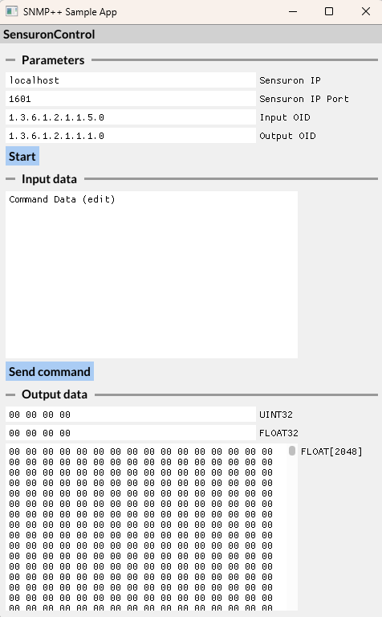

# Instructions: snmp-sample-app

# Updates

- [10/09/2024] - CLI-0.1 https://github.com/yacth/snmp-sample-app/tree/CLI-0.1
- [10/09/2024] - GUI-0.1 https://github.com/yacth/snmp-sample-app/tree/GUI-0.1

---

# Overview

The `snmp-sample-app` includes:

- A CLI version to run the program to send and receive packets using an SNMP agent through command lines.
- A GUI version to run the program to send and receive packets using an SNMP agent with a user interface made with [ImGui](https://github.com/ocornut/imgui).

---

# Prerequisite

- [Windows prerequisite](./instructions/README_WINDOWS_PREREQUISITE.md)

- [Linux prerequisite](./instructions/README_LINUX_PREREQUISITE.md)

---

# Installation

To run the application, create a folder in which the `snmp-sample-app`  will be installed, then run the following command using the terminal.

```bash
git clone https://github.com/yacth/snmp-sample-app.git
```

## CLI application

To run the CLI application, follow the instructions:

1. Open the terminal (`mingw64` terminal on windows) into the `path/to/snmp-sample-app` folder.
2. Run the command `git checkout tags/CLI-0.1` .
3. Run the command `xmake` to build the project.
4. Either use:
    1. `WinRunScript.bat` and follow the instructions
    2. Run the command `xmake run Sensuron [IP_ADDRESS] [IP_PORT] [INPUT_OID] [OUTPUT_OID] [COMMAND]` by giving all the parameters, 
    for example `xmake run Sensuron localhost 1601 1.3.6.1.2.1.1.5.0 1.3.6.1.2.1.1.1.0 "Test Command"` .

## GUI application

To run the GUI application, follow the instructions:

1. Open the terminal (`mingw64` terminal on windows) into the `path/to/snmp-sample-app` folder.
2. Run the command `git checkout tags/GUI-0.1` .
3. Run the command `xmake` to build the project.
4. Finally run the command `xmake run` , the GUI application should open.



To use the app:

1. Set the `Sensuron IP` , the `Sensuron IP Port` , the `Input OID` for the command data and the `Output OID` for the received payload.
2. Set the char buffer of the `Command Data`  and press `Send command`.