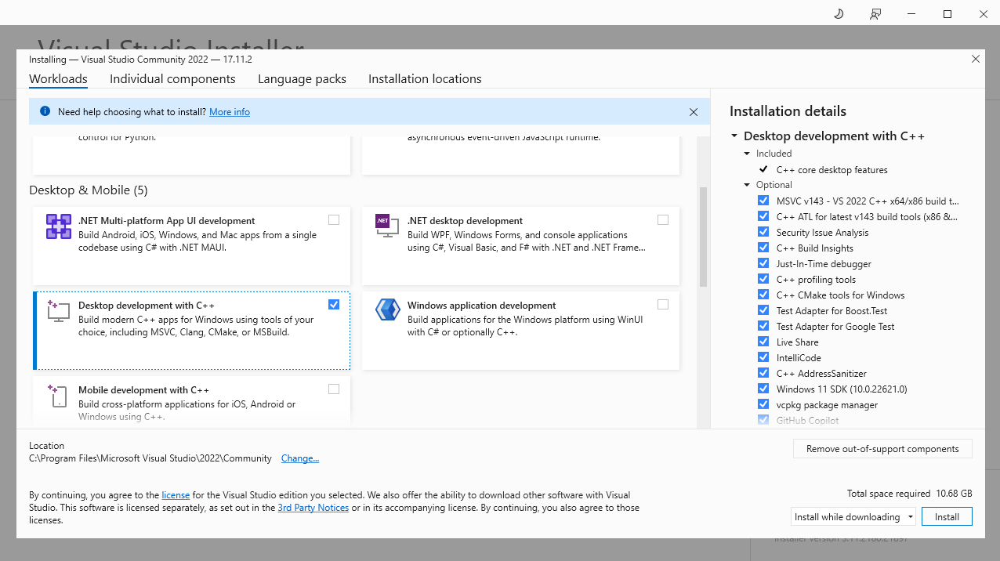

# Windows prerequisite

# MSYS2 - mingw64

`MSYS2` will be used to have a `UNIX-like` environment for the purpose of the building of the `snmp-sample-app` .

Install [MSYS2](https://www.msys2.org/) by downloading the [msys2-x86_64-20240727.exe](https://github.com/msys2/msys2-installer/releases/download/2024-07-27/msys2-x86_64-20240727.exe).

1. Run the installer to install `MSYS2` .
2. Follow the instructions to install `MSYS2` into the `C:\msys64` location as per default settings.
3. Run `MSYS2` .

Now `MSYS2` should be added to windows `PATH` be able to run it with any terminal.

1. Press `Win + R` .
2. Type `sysdm.cpl` and press `OK`.
3. Enter `Environment Variables...` menu, the `Environment Variables` window should open.
4. Double click on `Path` the `Edit environment variable`  should open.
5. Press `New` and add `C:\msys64\usr\bin` to the path.
6. Press `New` again and add `C:\msys64\mingw64\bin` to the path.
7. Press `OK` on the `Edit environment variable` window and press `OK` on the `Environment Variables` window.

When `MSYS2` is installed and running, the `mingw64` toolchain should be installed for later using the following instruction.

```bash
pacman -Syu
pacman -Su
pacman -S mingw-w64-x86_64-toolchain
pacman -S mingw-w64-x86_64-7zip
pacman -S mingw-w64-x86_64-cmake
pacman -S make

```

---

# Xmake

`Xmake` is a cross-platform build utility based on `Lua` scripting language, this will be the build tool that would be used for the  `snmp-sample-app` .

Open the terminal and run the following command:

```bash
pacman -S mingw-w64-x86_64-xmake
```

Set the `mingw` directory of `xmake` with the following command:

```bash
xmake g --mingw="C:\msys64\mingw64"
```

---

# Git

`Git` will be used to fetch packages using `xmake` and can be installed on windows using the following command:

```bash
pacman -S git
```

---

# Visual Studio

`Visual Studio` could be used for development purposes and debugging purposes.

Download the installation executable [VisualStudioSetup.exe](https://visualstudio.microsoft.com/fr/thank-you-downloading-visual-studio/?sku=Community&channel=Release&version=VS2022&source=VSLandingPage&cid=2030&passive=false) and follow the instructions:

1. Run the executable.
2. When the executable opens, select `Desktop development with C++` on the `Workloads` tab.
3. Press `Install` on the bottom right.

